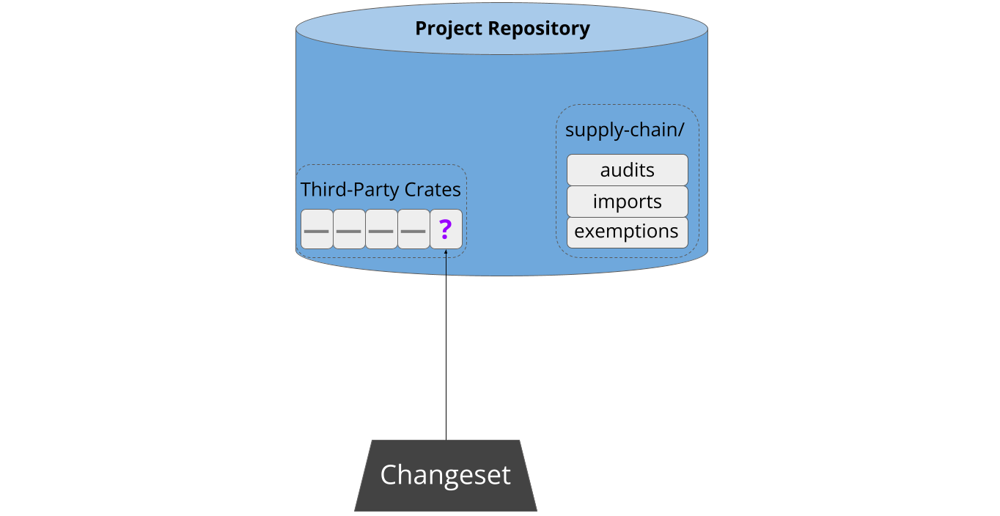
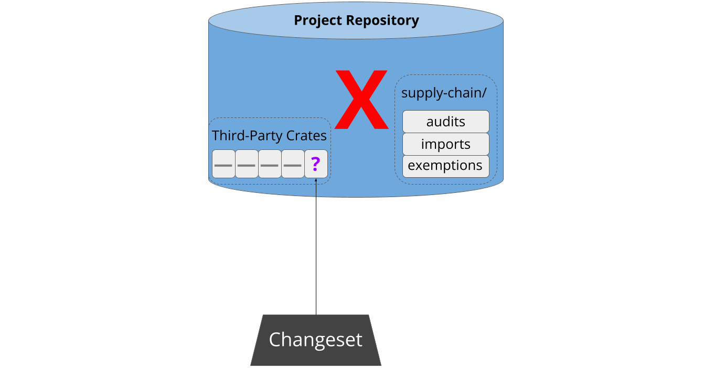
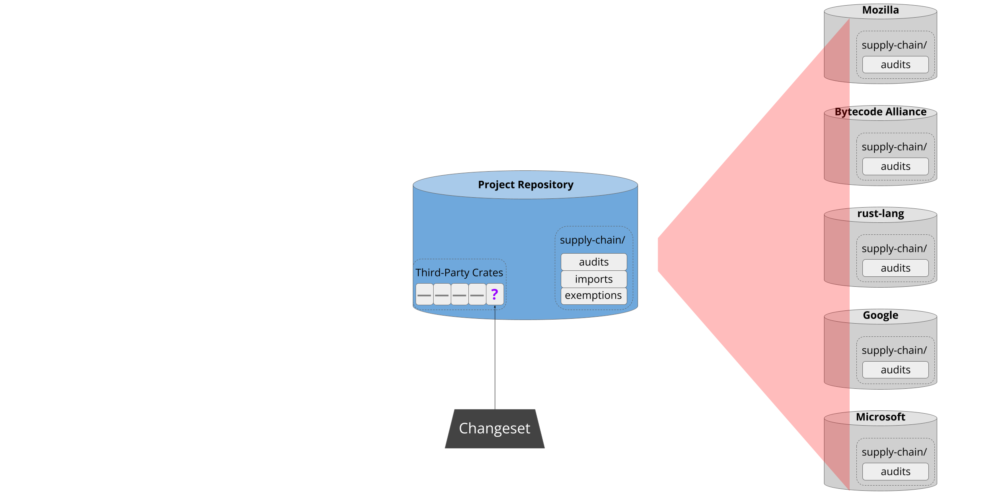
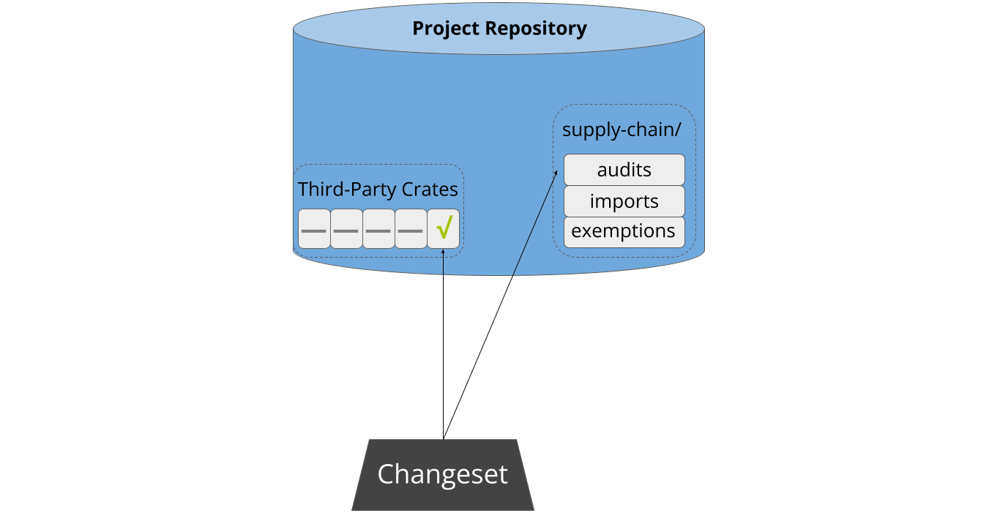
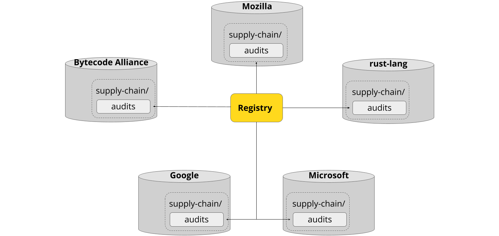

# How it Works

Most developers are busy people with limited energy to devote to supply-chain
integrity. Therefore, the driving principle behind cargo-vet is to minimize
friction and make it as easy as possible to do the right thing. Consequently it
aims to be trivial to set up, fit unobtrusively into existing workflows, guide
people through each step, and allow the entire ecosystem to share the work of
auditing widely-used packages.

This section provides a high-level overview of how the system operates to
achieve these goals.

## Setup

Cargo-vet is easy to set up. Most users will already have a repository with some
pre-existing third-party dependencies:

Enabling cargo-vet simply involves adding the tool as a linter, and creating
some metadata in the repository:

This takes about five minutes, and crucially, does not require you to audit the
existing dependencies. These are automatically added to the exemptions list:

This makes it very low-effort to get started, and allows people to tackle the
backlog incrementally from an approved state.

## Workflow

Sometime later, a developer attempts to pull new third-party code into the
project. This might be a new dependency, or an update to an existing one:

As part of continuous integration, cargo-vet analyzes the updated build graph to
verify that the new code has been audited by a trusted organization. If not, the
patch is refused:

Next, cargo-vet helps the developer figure out how to resolve the situation. The
first thing it does is to scan the registry to see if any well-known
organization has audited that package before:

If there’s a match, cargo-vet informs the developer and offers the option to add
that organization to the project’s trusted imports:

This enables projects to lazily build up an increasingly wide set of approved
crates.

It may be the case that the developer needs to perform the audit themselves, and
cargo-vet streamlines this process. Often someone will have already audited a
different version of the same crate, in which case cargo-vet computes the
relevant diffs and identifies the smallest one. After walking the developer
through the process of determining what to audit, it then presents the relevant
artifacts for inspection, either locally or on
[Sourcegraph](https://sourcegraph.com).

Cargo-vet minimizes developer friction by storing audits in-tree. This means
that developers don’t have to navigate or authenticate with an external system.
They already have a changeset adding the new third-party code, and can just
submit the relevant audits as part of that changeset:

Cargo-vet’s mechanisms for sharing and discovery are built on top of this
decentralized storage. Imports are implementing by pointing directly to the
audit files in the repositories of other organizations, and the registry is
simply an index audit files from well-known organizations:

This also means there’s no central infrastructure for an attacker to compromise:
imports used to vet the dependency graph are always fetched directly from the
relevant organization, and only after that organization has been explicitly
added to the trusted set.

Cargo-vet has a number of advanced features under the hood — it supports custom
audit criteria, configurable policies for different subtrees in the build graph,
and filtering out platform-specific code. These features are all completely
optional, and the baseline experience is designed to be simple and require
minimal onboarding.
